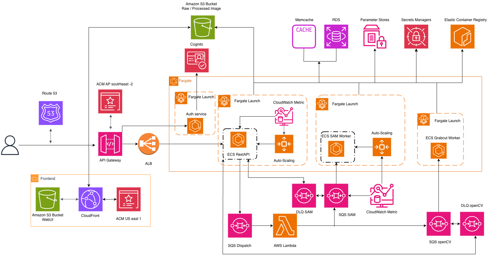

# LeafLab - Cloud-Native Leaf Segmentation Platform

**Author:** Yu-Kuan, Lin (N11233885) 

##  Project Overview
LeafLab is an open platform designed to help scientists prepare clean leaf photos. It automates the removal of messy backgrounds from field images, ensuring only the leaf remains visible.

The clean images produced by LeafLab can be sent to deep-learning models for downstream tasks like disease detection, saving time and improving consistency.

### Key Capabilities
* **Dual Segmentation Methods:** Supports both **OpenCV** (for faster, simpler tasks) and **SAM (Segment Anything Model)** (for complex, deep-learning-based segmentation).
* **Scalable Architecture:** Built on AWS ECS Fargate with event-driven autoscaling.

---

##  System Architecture

### High-Level Design
The application follows a **Microservices Architecture** split into 4 distinct services to isolate failures and scale independently .

* **Load Distribution:** Uses **API Gateway** as the single entry point, forwarding traffic to an **Application Load Balancer (ALB)**.
* **Async Processing:** Uses **SQS** to decouple the API from heavy worker processes.
* **Storage:** S3 for images, RDS (PostgreSQL) for metadata, and ElastiCache (Memcached) for caching.

### Microservices Breakdown
| Service Name | Role | Compute | Source Path |
| :--- | :--- | :--- | :--- |
| **Auth Service** | Handles authentication via Cognito | ECS Fargate (1 vCPU / 3 GB) | `/app/*`  |
| **API Service** | Public-facing REST API | ECS Fargate (1 vCPU / 3 GB) | `/cognito-auth-service/*`  |
| **GrabCut Worker** | Lightweight OpenCV-based segmentation | ECS Fargate (1 vCPU / 3 GB) | `/grabcut_worker/*` |
| **SAM Worker** | CPU-intensive SAM model segmentation | ECS Fargate (≥4 vCPU / 8 GB) | `/worker/*`  |

---

##  AWS Technologies Used

* **Compute:** AWS Fargate (ECS), AWS Lambda.
* **Networking:** Route 53, CloudFront, API Gateway, ALB, VPC.
* **Storage & Database:** S3, RDS (PostgreSQL), ElastiCache (Memcached).
* **Messaging:** SQS (Standard & Dead-Letter Queues).
* **Security:** Cognito (Auth), ACM (Certificates), Secrets Manager, SSM Parameter Store.
* **Monitoring:** CloudWatch (Logs, Alarms, Custom Metrics).

---

##  Autoscaling Strategy

LeafLab uses a custom CloudWatch metric to scale the worker services based on the **Backlog Per Task** logic, rather than simple CPU usage.

### Custom Metric Formula
The scaling decision is based on `WaitSeconds`:

$$
WaitSeconds = \frac{(m1 + m2)}{\max(m3, 1)} \times 60
$$

Where:
* `m1`: SQS Visible Messages (Backlog)
* `m2`: SQS Invisible Messages (In-flight) 
* `m3`: Running Task Count (Current capacity) 

**Scaling Policies:**
* **Scale Out:** When `WaitSeconds > 75s` (3 data points).
* **Scale In:** When `WaitSeconds < 50s` (3 data points).

---

##  Cost Analysis (Estimated)

* **Total Estimated Monthly Cost:** ~$356.90 USD (for 10 concurrent users).
* **Major Cost Drivers:**
    * **AWS Fargate:** ~$314.18 (Running 4 always-on services).
    * **S3 & Networking:** ~$18.00+ for storage and load balancing.

---

##  Future Roadmap
* **Architecture Split:** Split the API service into `Files Service` and `Jobs Service` (CQRS pattern) .
* **GPU Acceleration:** Move SAM workers to GPU instances to reduce latency.
* **Sustainability:** Schedule non-urgent jobs during off-peak hours (cooler times) to reduce energy impact.
